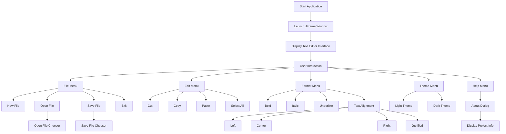

<h1 align="center">
Simple Java Text Editor
</h1>

A lightweight **Java Swing text editor** developed as part of an academic project.

## Course

Object Oriented Methodology (OOM)

## Features

- Create, open, and save text files
- Text formatting (Bold, Italic, Underline)
- Text alignment (Left, Right, Center, Justified)
- Clipboard operations (Cut, Copy, Paste)
- Light and Dark themes
- Keyboard shortcuts
- File chooser integration

## Technologies Used

- Java
- Java Swing
- Event Handling
- File I/O

## Application Flow

## How to Run

Compile:
javac SimpleTextEditor.java

Run:
java SimpleTextEditor

## Authors

| Name | Role |
|-----|-----|
Aashi Tiwari | Development |
Danny Thomas | Development |

This project was developed collaboratively as part of an **academic team project**.

---

© 2026 Aashi Tiwari

This repository is maintained by **Aashi Tiwari**.
